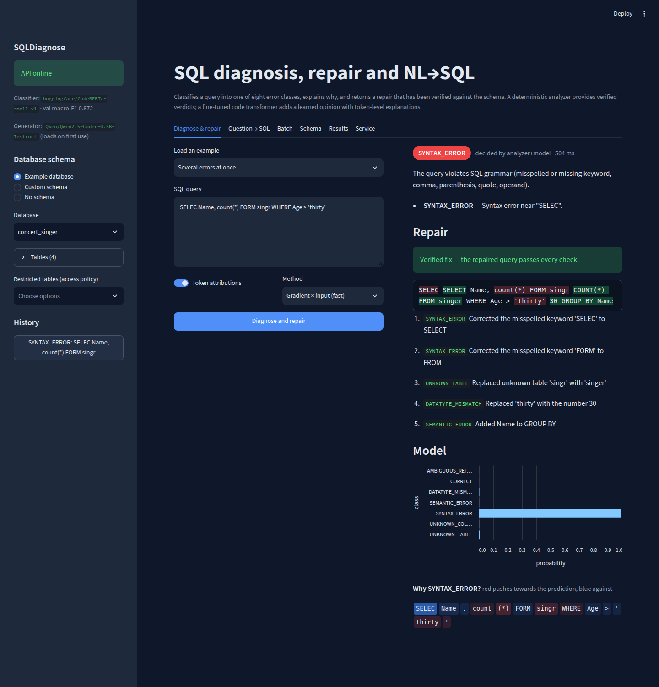
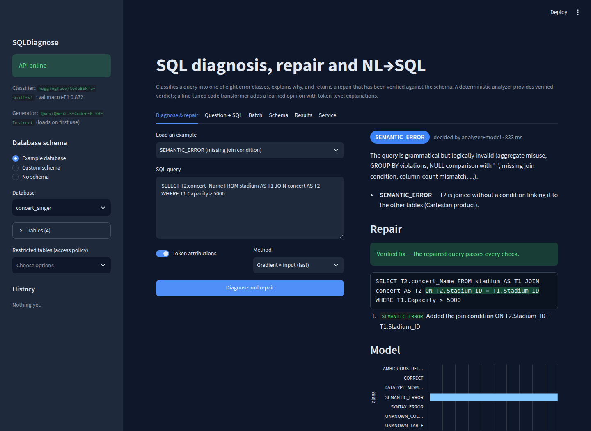

# SQLDiagnose

[](https://github.com/thilaganiniyavan/SQLDiagnose/actions/workflows/tests.yml)

Diagnose, explain and repair SQL queries, and turn natural-language questions into verified SQL.

Given a query and (optionally) a database schema, SQLDiagnose tells you **whether the query is wrong and why**,
using one of eight error classes, and **proposes a repaired query that it has verified**. A fine-tuned code
transformer gives a learned second opinion with token-level explanations, and a text-to-SQL model generates
queries that go through the same verify-and-repair loop.

| Class | Meaning | Example |
|---|---|---|
| `CORRECT` | no problem found | `SELECT name FROM singer WHERE age > 30` |
| `SYNTAX_ERROR` | grammar violation | `SELECT name FORM singer` |
| `UNKNOWN_TABLE` | table not in the schema | `SELECT name FROM singers` |
| `UNKNOWN_COLUMN` | column not in the referenced table | `SELECT nme FROM singer` |
| `DATATYPE_MISMATCH` | incompatible types compared / aggregated | `WHERE age = 'old'`, `AVG(name)` |
| `AMBIGUOUS_REFERENCE` | reference matches several tables, or an alias is reused | `SELECT name FROM singer JOIN stadium ON ...` |
| `PERMISSION_DENIED` | touches a table/column restricted by an access policy | `SELECT salary FROM staff` |
| `SEMANTIC_ERROR` | grammatical but logically invalid | `WHERE count(*) > 1`, `= NULL`, missing `GROUP BY` or join condition |



<details><summary>Missing join condition repaired from the foreign key</summary>


</details>

## Results

Measured on 1,400 test queries from 20 Spider databases that never appear in training
(full report: [`reports/evaluation_report.md`](reports/evaluation_report.md), paper draft: [`reports/paper_draft.md`](reports/paper_draft.md)).

| | Accuracy | Macro-F1 |
|---|---|---|
| TF-IDF + logistic regression | 53.1 | 51.3 |
| CodeBERTa-small, query only (ablation) | 47.1 | 47.0 |
| **CodeBERTa-small, query + schema** (trained on a laptop CPU) | **87.4** | **87.6** |

* **Repair:** 86.3% of erroneous test queries get a verified fix, and 63.4% are restored exactly to the original.
  Syntax and unknown-table errors are 93–96% exact. Mean repair time is 33 ms.
* **Analyzer:** 96.5% of the 8,034 human-written Spider queries pass; the rest are genuine issues.
  The access-policy check is 100% correct on 400 query/policy pairs.
* **NL→SQL** (150 Spider-dev questions, same questions for both generators):

  | Generator | Valid SQL: raw → verified + repaired | Correct result: raw → final |
  |---|---|---|
  | T5-small (text-to-SQL) | 34.7% → 66.7% | 16.0% → 22.0% |
  | **Qwen2.5-Coder-0.5B-Instruct** (default) | **54.0% → 88.0%** | **40.0% → 54.7%** |

* The classifier's weakest class is `UNKNOWN_COLUMN` (F1 71%). A larger encoder can be trained on a free GPU
  with [`notebooks/train_codebert_gpu.ipynb`](notebooks/train_codebert_gpu.ipynb).

A 5-minute demo script with likely reviewer questions is in [`docs/DEMO.md`](docs/DEMO.md).

## How it works

```
                 ┌───────────────────────────────┐
 query ─────────►│ Analyzer (deterministic)      │── issues, verified class ──┐
 schema ────────►│  1. SQLite compiles the query │                            │
 access policy ─►│     against an empty DB with  │                            ▼
                 │     the schema (EXPLAIN only) │                   ┌────────────────┐
                 │  2. AST rules (sqlglot):      │                   │ Diagnosis      │── API / UI / CLI
                 │     GROUP BY, NULL, joins,    │                   │ service (fuse) │
                 │     types, aliases, policy    │                   └────────────────┘
                 └───────────────────────────────┘                            ▲
 query + schema ─► Transformer classifier (CodeBERTa / CodeBERT) ─ probabilities, attributions
 erroneous query ─► Repair engine: candidate fixes per issue → re-analyze → keep smallest verified fix → repeat
 question ───────► code LLM (Qwen2.5-Coder-0.5B) → candidate → verify → [more candidates] → repair
```

* **Analyzer** (`analysis/`): the query is compiled (never executed) by SQLite against an in-memory database
  built from the schema, which yields precise grammar, name-resolution and several semantic errors. Rules on the
  sqlglot AST add what SQLite tolerates but standard SQL rejects (`= NULL`, non-grouped columns, missing join
  conditions, type mismatches, duplicate aliases, self-comparisons) and the access-policy check. Without a
  schema it still checks grammar and schema-independent semantics.
* **Classifier** (`models/classifier.py`): a code transformer fine-tuned on `query </s></s> schema` pairs to
  predict the seven learnable classes. It provides calibrated probabilities and integrated-gradients
  explanations. The analyzer's verdict wins whenever it finds a problem; the model is decisive only when no
  schema is available, and flags anything it disagrees with.
* **Repair engine** (`repair/`): for the primary issue it proposes candidates — edit-distance keyword
  correction, fuzzy and foreign-key-aware table/column matching, alias qualification, FK-inferred join
  conditions, AST rewrites (`IS NULL`, `HAVING`, `GROUP BY`, scalar subqueries, casts) and a bounded
  single-edit search — re-analyzes every candidate and keeps the smallest verified fix, iterating for
  multi-error queries. It never reports success for a query that does not pass the analyzer.
* **Dataset** (`data_pipeline/`): errors are injected into Spider gold queries with 25+ span-level mutation
  operators; every sample is kept only if the analyzer independently confirms its label. Surface features
  (keyword case, spacing, literals, alias names) are randomised for all classes. Train/validation/test use
  disjoint databases (test = Spider-dev databases), see [`data/processed/dataset_report.md`](data/processed/dataset_report.md).

## Quick start

Run the demo (about 5 minutes, no training needed):

```bash
git clone https://github.com/thilaganiniyavan/SQLDiagnose.git && cd SQLDiagnose
make setup        # virtual environment + dependencies
make model        # downloads the fine-tuned classifier (310 MB) from the GitHub release
make api          # terminal 1: REST API, docs at http://localhost:8000/docs
make ui           # terminal 2: UI at http://localhost:8501
```

The NL→SQL generator (Qwen2.5-Coder-0.5B, ~1 GB) downloads automatically on the first *Question → SQL*
request. `make help` lists all tasks; each one is a plain command you can also run directly.

Reproduce the research results:

```bash
make data         # downloads Spider and rebuilds the dataset (identical to data/processed)
make train        # CodeBERTa-small, 3 epochs (several hours on CPU; GPU: notebooks/train_codebert_gpu.ipynb)
make finetune     # 2 further epochs from the best checkpoint (how the released model was produced)
make evaluate     # -> reports/evaluation_report.md, reports/results.json, reports/figures/
make test
```

`python -m training.train --resume` continues an interrupted run.

Without a trained checkpoint the API and UI still work with the deterministic analyzer and repair engine;
`GET /api/v1/health` reports `model_loaded: false`.

> If your virtual environment was moved, the `pip`/`uvicorn`/`streamlit` launchers may point to the old path.
> `python -m <tool>` always works.

### Command line

```bash
python cli.py diagnose "SELECT nme FROM singer" --db concert_singer
python cli.py repair   "SELEC name, count(*) FORM singr WHERE age > 'thirty'" --db concert_singer
#  VERIFIED FIX
#    SELECT name, COUNT(*) FROM singer WHERE age > 30 GROUP BY name
python cli.py nl2sql   "How many singers are from France?" --db concert_singer
python cli.py diagnose "SELECT * FROM staff" --ddl schema.sql --dialect postgres --restrict staff
python cli.py dbs      # bundled example schemas (the 160 Spider databases)
```

### REST API (`/api/v1`)

| Method | Path | Purpose |
|---|---|---|
| POST | `/diagnose` | classify one query (`explain: true` adds token attributions) |
| POST | `/repair` | diagnosis + verified repair |
| POST | `/batch` | many queries against one schema, optional repair |
| POST | `/upload` | CSV with a `query` column (optional `db_id` column) |
| POST | `/nl2sql` | question → verified SQL (candidates, repair, diagnosis) |
| GET | `/schemas`, `/schemas/{db_id}` | bundled example schemas |
| POST | `/schemas/parse-ddl`, `/schemas/parse-sqlite`, `/schemas/parse-live` | import a schema |
| GET | `/health`, `/labels`, `/metrics` | service status, taxonomy, counters |

Every query endpoint takes the schema either inline (`database_schema`) or by name (`db_id`), plus an optional
`access_policy` (`{"restricted_tables": [...], "restricted_columns": ["table.col"]}`):

```bash
curl -s localhost:8000/api/v1/repair -H 'content-type: application/json' \
  -d '{"query": "SELECT name FROM singr", "db_id": "concert_singer"}'
```

Schema format: `{"table": {"columns": {"col": "TYPE"}, "primary_keys": [...], "foreign_keys": [{"column": .., "target_table": .., "target_column": ..}]}}`.

### Docker

```bash
docker compose -f deployment/docker-compose.yml up --build     # API on :8000, UI on :8501
```

## Project layout

```
analysis/          schema model + deterministic analyzer
data_pipeline/     Spider loader, mutation operators, dataset builder, schema parsers
models/            domain (labels, entities, interfaces), transformer classifier, NL2SQL generators
repair/            verified repair engine
services/          use cases: diagnosis (analyzer + model + repair), NL2SQL, schema registry
training/          fine-tuning script (CPU/GPU, resumable)
evaluation/        metrics, baselines, explainability, full evaluation → reports/
deployment/        FastAPI app, Dockerfile, compose file
frontend/          Streamlit UI
notebooks/         GPU training notebook (Colab/Kaggle)
configs/           training / API / UI configuration
data/processed/    generated dataset (jsonl/csv), schemas.json, dataset report
docs/design/       original research and design documents
tests/             pytest suite (python -m pytest)
```

## Testing

```bash
python -m pytest            # analyzer, repair, mutations, dataset integrity, schema parsing, services, API
```

## Limitations

* Errors in the dataset are injected synthetically; natural errors (e.g. from text-to-SQL models) are evaluated
  separately in the report.
* Labels come from the analyzer, so the classifier learns to approximate it; the analyzer itself is audited
  against human-written Spider queries.
* Checks follow SQLite semantics plus portable (PostgreSQL/MySQL-strict) rules; engine-specific behaviour can differ.
* `DATATYPE_MISMATCH` repairs are only proposed when the intended value is recoverable (`'5'`, `'thirty'`, casts).
