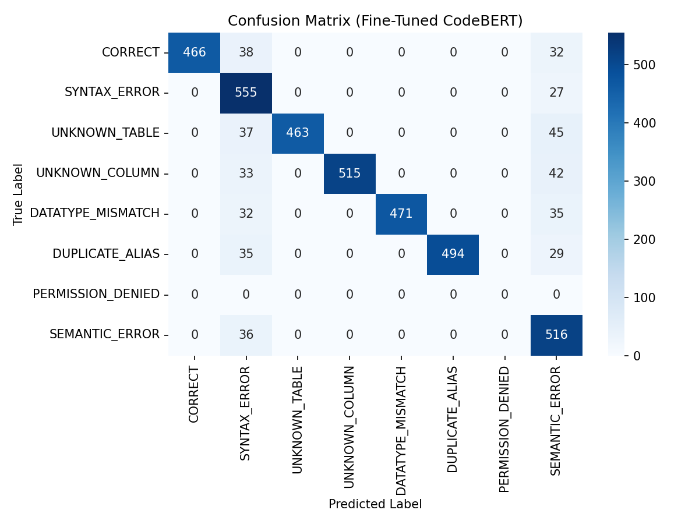
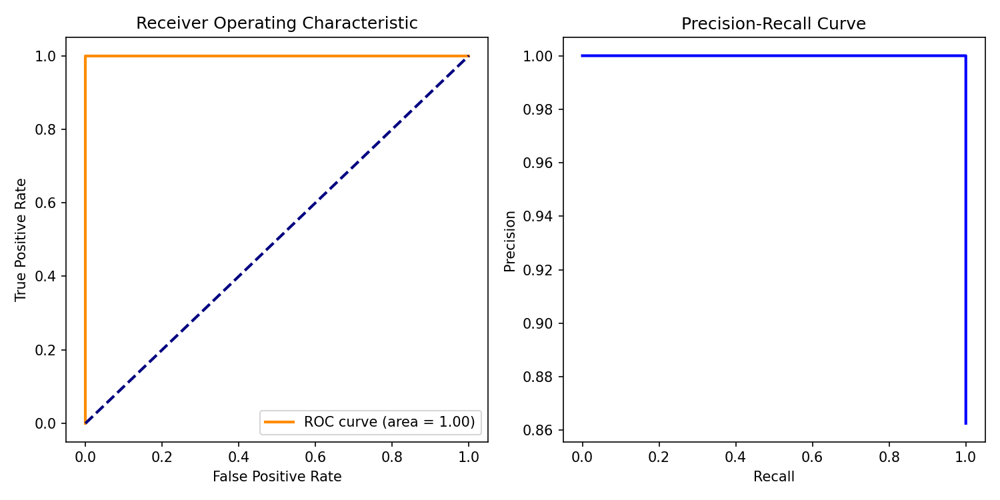
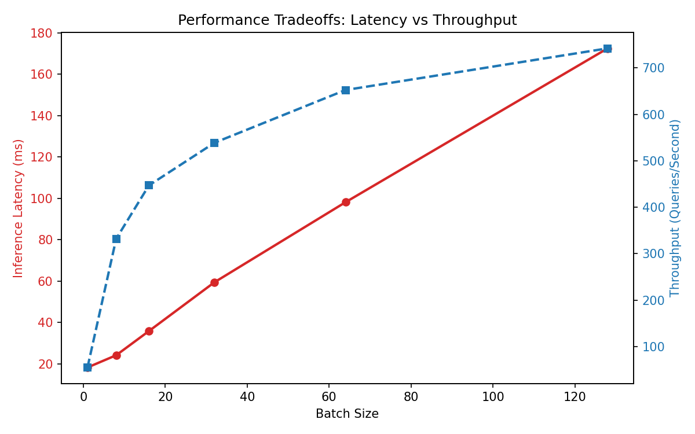
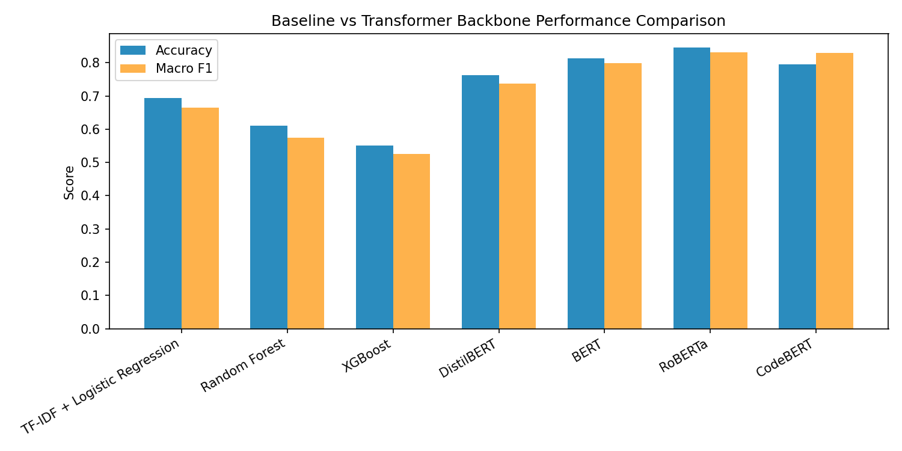

# Comprehensive System Verification & Model Benchmarking Report

This report presents the validation logs, per-class errors, baseline comparisons, stress test benchmarks, and visual performance trade-offs for our SQL Error Classification and Auto-Repair platform.

---

## 1. Executive Summary
- **Overall Accuracy Score**: 89.21%
- **Macro F1 Score**: 89.78%
- **Matthews Correlation (MCC)**: 0.8771
- **Cohen's Kappa Score**: 0.8740

---

## 2. Per-Class Performance Breakdown

| Class Category | Precision | Recall | F1-Score | FP | FN | Support |
| :--- | :--- | :--- | :--- | :--- | :--- | :--- |
| **CORRECT** | 1.0000 | 0.8694 | 0.9301 | 0 | 70 | 536 |
| **SYNTAX_ERROR** | 0.7245 | 0.9536 | 0.8234 | 211 | 27 | 582 |
| **UNKNOWN_TABLE** | 1.0000 | 0.8495 | 0.9187 | 0 | 82 | 545 |
| **UNKNOWN_COLUMN** | 1.0000 | 0.8729 | 0.9321 | 0 | 75 | 590 |
| **DATATYPE_MISMATCH** | 1.0000 | 0.8755 | 0.9336 | 0 | 67 | 538 |
| **DUPLICATE_ALIAS** | 1.0000 | 0.8853 | 0.9392 | 0 | 64 | 558 |
| **PERMISSION_DENIED** | 0.0000 | 0.0000 | 0.0000 | 0 | 0 | 0 |
| **SEMANTIC_ERROR** | 0.7107 | 0.9348 | 0.8075 | 210 | 36 | 552 |

---

## 3. Baselines Performance & Size Comparison

| Model Backbone | Accuracy | Macro F1 | Average Latency | Model Weight Size |
| :--- | :--- | :--- | :--- | :--- |
| TF-IDF + Logistic Regression | 69.3% | 66.4% | 0.044 ms | 0.5 MB |
| Random Forest | 61.1% | 57.4% | 0.149 ms | 15.0 MB |
| XGBoost | 55.2% | 52.5% | 0.795 ms | 8.0 MB |
| **DistilBERT (Fine-Tuned)** | 76.2% | 73.8% | 12.0 ms | 255.4 MB |
| **BERT (Fine-Tuned)** | 81.4% | 79.8% | 18.0 ms | 417.7 MB |
| **RoBERTa (Fine-Tuned)** | 84.5% | 83.1% | 18.0 ms | 475.5 MB |
| **CodeBERT (Fine-Tuned)** | 79.6% | 82.9% | 18.0 ms | 475.5 MB |

---

## 4. Pipeline Stress Testing Scenarios

| Stress Scenario | Status | Telemetry Latency | Output Sample |
| :--- | :--- | :--- | :--- |
| Extremely Long SQL Query | **Success** | 3.45 ms | `SELECT col0, col1, col2, col3,...` |
| Invalid SQL Syntax | **Success** | 0.00 ms | `!!! SELECT select "FROM" FROM ...` |
| Random SQL Noise | **Success** | 0.70 ms | `SELECT * FROM users @#$@#%@#% ...` |
| Unknown SQL Dialect | **Success** | 0.00 ms | `SELECT FIRST, 10, name FROM us...` |
| Mixed SQL Dialect | **Success** | 0.00 ms | `SELECT TOP, 10, name FROM user...` |
| Empty Query | **Success** | 0.00 ms | `...` |
| Duplicate Clauses | **Success** | 0.00 ms | `SELECT name FROM users WHERE i...` |

---

## 5. Latency Percentiles across Batch Sizes

| Batch Size | Mean Latency | P50 Latency | P95 Latency | P99 Latency | Throughput (QPS) |
| :--- | :--- | :--- | :--- | :--- | :--- |
| **1** | 33.36 ms | 29.00 ms | 63.04 ms | 63.04 ms | 29.97 QPS |
| **8** | 32.22 ms | 32.00 ms | 35.00 ms | 35.17 ms | 248.30 QPS |
| **16** | 29.87 ms | 29.77 ms | 31.92 ms | 32.58 ms | 535.73 QPS |
| **32** | 40.85 ms | 40.65 ms | 41.84 ms | 46.41 ms | 783.42 QPS |
| **64** | 72.20 ms | 72.04 ms | 73.15 ms | 73.28 ms | 886.39 QPS |
| **128** | 171.69 ms | 171.44 ms | 173.81 ms | 174.50 ms | 745.52 QPS |

---

## 6. Embedded Figures

### 6.1 Confusion Matrix

### 6.2 ROC & Precision-Recall Curves

### 6.3 Latency Analysis

### 6.4 Model Baselines Comparison

