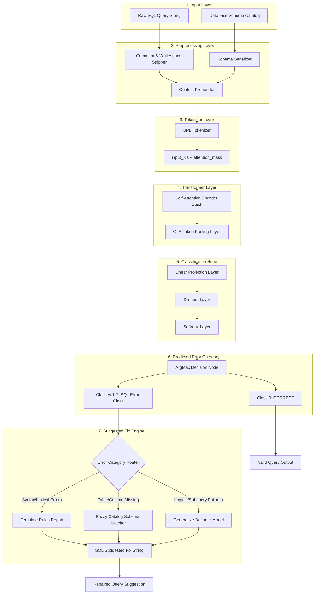
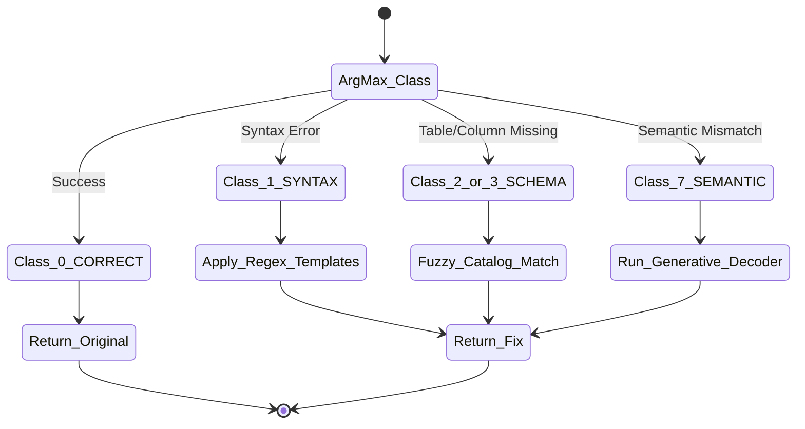

# Software Architecture Design

This document outlines the software architecture for the complete end-to-end SQL query parsing, error classification, and repair suggestion pipeline. It maps the flow of data from raw user input to a resolved SQL suggestion.

---

## 1. System Architecture Data Flow

The diagram below maps the execution pipeline from raw input to predicted error classification and its corresponding suggested correction:

---

## 2. Pre-to-Post Process Layer Specifications

### Step 1: Preprocessing Layer
-   **Inputs**: A raw SQL string and a serialized JSON representation of the database schema.
-   **Operation**:
    1.  Strips SQL comments (`--` and `/* ... */`).
    2.  Normalizes spaces and casing on primary SQL keywords.
    3.  Prepend schema context to query context:
        `[SCHEMA] users(id, name, age) [QUERY] SELECT user_name FROM users`

### Step 2: Tokenization Layer
-   **Operation**: Converts the standardized string into subword sequences matching the pre-trained model vocabulary.
-   **Outputs**:
    -   `input_ids`: A token index sequence padded to maximum sequence length.
    -   `attention_mask`: Binary masks ($1$ for valid text tokens, $0$ for padding tokens).

### Step 3: Transformer (Encoder) Layer
-   **Operation**: Passes tensors through multi-headed self-attention layers (e.g. 12 layers in CodeBERT) to generate a sequence of context-aware vectors of dimension $H$ (typically $H=768$).
-   **Outputs**: The representation vector corresponding to the special classification token (`[CLS]` or `<s>`) which encapsulates global query syntax and schema alignment.

### Step 4: Classification Head
-   **Operation**: A classification MLP head mapping encoder embeddings to class scores:
    $$\mathbf{y} = \text{Softmax}(\mathbf{W}_2 \cdot \text{ReLU}(\mathbf{W}_1 \cdot \mathbf{x} + \mathbf{b}_1) + \mathbf{b}_2)$$
    where $\mathbf{x}$ is the pooled output embedding.
-   **Outputs**: Probability distribution array across our 8 target classes:
    -   `Class 0`: `CORRECT`
    -   `Class 1`: `SYNTAX_ERROR`
    -   `Class 2`: `TABLE_NOT_FOUND`
    -   `Class 3`: `COLUMN_NOT_FOUND`
    -   `Class 4`: `DATA_TYPE_MISMATCH`
    -   `Class 5`: `AMBIGUOUS_COLUMN`
    -   `Class 6`: `PERMISSION_DENIED`
    -   `Class 7`: `SEMANTIC_VIOLATION`

---

## 3. Predicted Error & Suggested Fix Router

If the query falls into classes `1`-`7`, the system activates the **Suggested Fix Engine**, selecting the repair strategy based on the predicted category:

### Repair Strategies Detailed

1.  **Lexical/Template Repair (`Class 1`)**:
    -   *Trigger*: Predicted class is `SYNTAX_ERROR` or syntax anomalies like `NULL Comparison`.
    -   *Strategy*: Applies token regex templates (e.g., substituting `= NULL` with `IS NULL`, closing unmatched bracket sequences, or inserting missing commas in projection lists).
2.  **Schema-Fuzzy Matcher (`Class 2` / `Class 3` / `Class 5`)**:
    -   *Trigger*: Table or Column not found, or ambiguous column references.
    -   *Strategy*: Extracts the invalid identifier from the AST. Computes Levenshtein/Jaro-Winkler string distances against tables and columns in the active `Database Schema Catalog`. Replaces the invalid reference with the highest scoring match above a threshold (e.g., mapping misspelled `user_id` to schema-valid `id`).
3.  **Generative Decoder Repair (`Class 4` / `Class 7`)**:
    -   *Trigger*: Datatype mismatches or complex semantic violations.
    -   *Strategy*: Passes the query, database schema prefix, and target error class to a lightweight Seq2Seq model (such as fine-tuned CodeT5). The decoder generates the corrected query string.
