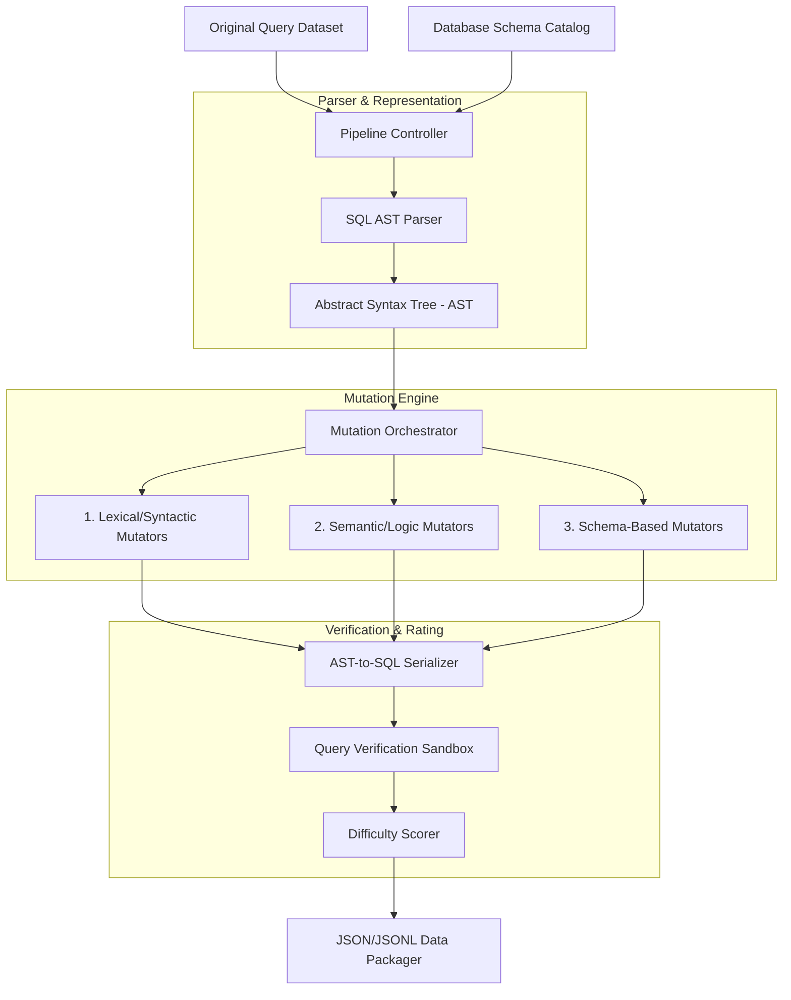

# Synthetic SQL Error Generation Pipeline Architecture

This document describes the architectural design for the automated generation of buggy SQL datasets. The pipeline ingests syntactically correct SQL queries (from Spider, BIRD, etc.) along with their database schemas, applies realistic syntactic, semantic, and schema-level mutations, validates the resulting errors, and outputs a labeled dataset.

---

## 1. System Architecture Diagram



---

## 2. Component Design & Pipeline Stages

### Stage A: Parsing & Semantic Modeling
To ensure mutations are realistic (mimicking human mistakes) rather than arbitrary text corruptions, queries are analyzed structural-first:
1.  **SQL AST Parser**: Converts raw SQL query strings into a structured Abstract Syntax Tree (using libraries like `sqlglot` or `sqlparse`).
2.  **Schema Catalog Resolver**: Maps query tokens (columns, tables, aliases) to their physical table catalog structures.

---

### Stage B: Mutation Orchestrator
The core of the pipeline contains distinct mutation components. The Orchestrator randomly selects a target error type or applies multiple errors based on target distributions.

#### 1. Lexical & Syntactic Mutators (AST Token Manipulation)
*   **Missing Comma**: Scans the SELECT projection list or GROUP BY expressions and deletes a separating comma token.
*   **Missing FROM**: Locates the `FROM` node and deletes it along with its target references, leaving the projection list dangling.
*   **Wrong Parentheses**: Swaps parenthesis bounds in arithmetic, logical comparisons, or subquery brackets to create grouping mismatches.
*   **Reserved Keyword Misuse**: Replaces column/table identifiers with SQL reserved keywords (e.g., naming a column `select` or `group` without escaping quotes).

#### 2. Semantic & Logical Mutators (Abstract Logic Alters)
*   **Wrong JOIN**: Mutates join type nodes (e.g., swapping `INNER JOIN` to `CROSS JOIN` or `LEFT JOIN`).
*   **Missing JOIN Condition**: Deletes the `ON` or `USING` node attached to a `JOIN` node, resulting in unintended cartesian products or syntax errors.
*   **Incorrect GROUP BY**: Modifies GROUP BY lists. It either drops fields present in the SELECT projection list (standard SQL violation) or adds unrelated columns.
*   **Aggregate Misuse**: Nesting aggregate functions (e.g. `MAX(SUM(sales))`) or including non-aggregate columns in the projection list without listing them in the `GROUP BY` clause.
*   **HAVING without GROUP BY**: Inserts a `HAVING` conditional clause without a preceding `GROUP BY` clause.
*   **ORDER BY Mistake**: Places aggregate functions in `ORDER BY` when they are not in the projection, or orders by expressions that violate grouping boundaries.
*   **LIMIT Misuse**: Uses float values, negative integers, or non-numeric parameter inputs inside the `LIMIT` or `OFFSET` statements.
*   **Subquery & Nested Query Errors**: Removes alias references from nested subqueries (violating query parsing requirements) or mismatching projection columns in subquery comparisons (e.g., `WHERE id IN (SELECT name, email FROM...)`).
*   **NULL Comparison Errors**: Replaces logical comparisons of nulls (`IS NULL` / `IS NOT NULL`) with raw comparative operations (e.g., `= NULL` or `!= NULL`), which fail semantic expectations.
*   **Function Misuse**: Replaces standard SQL functions with incompatible equivalents or passes incorrect parameter counts (e.g., `ROUND(name)` where name is a VARCHAR).

#### 3. Schema-Based Mutators (Schema Catalog Violations)
*   **Unknown Column**: Swaps valid column names with similar but non-existent ones (e.g., changing `user_id` to `userid` or `user_name` to `account_name`).
*   **Unknown Table**: Replaces table names with spelling variants or tables from outside the target schema definition.
*   **Incorrect/Duplicate Alias**: Changes table aliases in select targets while keeping original aliases in the FROM clause, or assigns the same alias name to two distinct joined tables.
*   **Datatype Mismatch**: Mutates WHERE clause boundaries to compare incompatible columns (e.g., comparing a VARCHAR column to an INT column or applying mathematical operators to DATE fields).

---

### Stage C: Verification Sandbox
Once a query is mutated, it is processed through the **Query Verification Sandbox**:
1.  **AST-to-SQL Serializer**: Converts the modified AST back into a clean string representation.
2.  **Dry-Run Validation**: Executes the query against a mock database environment or standard parsing engine (e.g., SQLite / PostgreSQL parser).
    - If the query still executes successfully without errors (which can happen with logical swaps like `LEFT JOIN` to `INNER JOIN`), the pipeline labels it as a logical anomaly or discards it depending on configuration settings.
    - If it fails, the database exception message is captured to verify the target `error_type` classification is correct.

---

### Stage D: Difficulty Scorer
The system computes an execution difficulty rating:
*   **EASY**: Syntactic errors that are easily caught by standard SQL parsers without schema context (e.g. *Missing Comma*, *Missing FROM*, *Wrong Parentheses*).
*   **MEDIUM**: Semantic and schema-based errors affecting standard columns or single-join levels (e.g. *Unknown Column*, *Unknown Table*, *HAVING without GROUP BY*, *NULL Comparison*).
*   **HARD**: Complex semantic violations in multi-level subqueries, nested CTEs, aggregate scopes, or join-condition omissions (e.g. *Subquery Errors*, *Aggregate Misuse*, *Missing JOIN Conditions*).

---

## 3. Data Output Schema

Every synthetic sample generated by this pipeline is formatted into a standardized schema for model ingestion:

```json
{
  "original_query": "SELECT u.name, p.bio FROM users AS u JOIN profiles AS p ON u.id = p.user_id WHERE u.age > 18",
  "modified_query": "SELECT u.name, p.bio FROM users AS u JOIN profiles AS p ON u.id = WHERE u.age > 18",
  "error_type": "MISSING_JOIN_CONDITION",
  "difficulty": "HARD",
  "database_schema": {
    "users": [
      {"column_name": "id", "data_type": "INTEGER", "primary_key": true},
      {"column_name": "name", "data_type": "VARCHAR"},
      {"column_name": "age", "data_type": "INTEGER"}
    ],
    "profiles": [
      {"column_name": "id", "data_type": "INTEGER", "primary_key": true},
      {"column_name": "user_id", "data_type": "INTEGER", "foreign_key": "users.id"},
      {"column_name": "bio", "data_type": "TEXT"}
    ]
  }
}
```

---

## 4. Class Hierarchies & Extension Interfaces

To enforce Clean Architecture, the pipeline components will inherit from domain interfaces in `datasets/`:

1.  **`ISQLMutator` (Interface)**:
    ```python
    class ISQLMutator(ABC):
        @abstractmethod
        def mutate(self, ast_node: ASTNode, schema: Dict) -> ASTNode:
            """Applies mutation to the given AST node, returning the modified AST."""
            pass
    ```
2.  **`SQLMutationPipeline` (Controller)**: Handles load flows, iterates over register arrays of `ISQLMutator` interfaces, validates outcomes in the local db parser sandbox, and calculates final difficulty scores.
