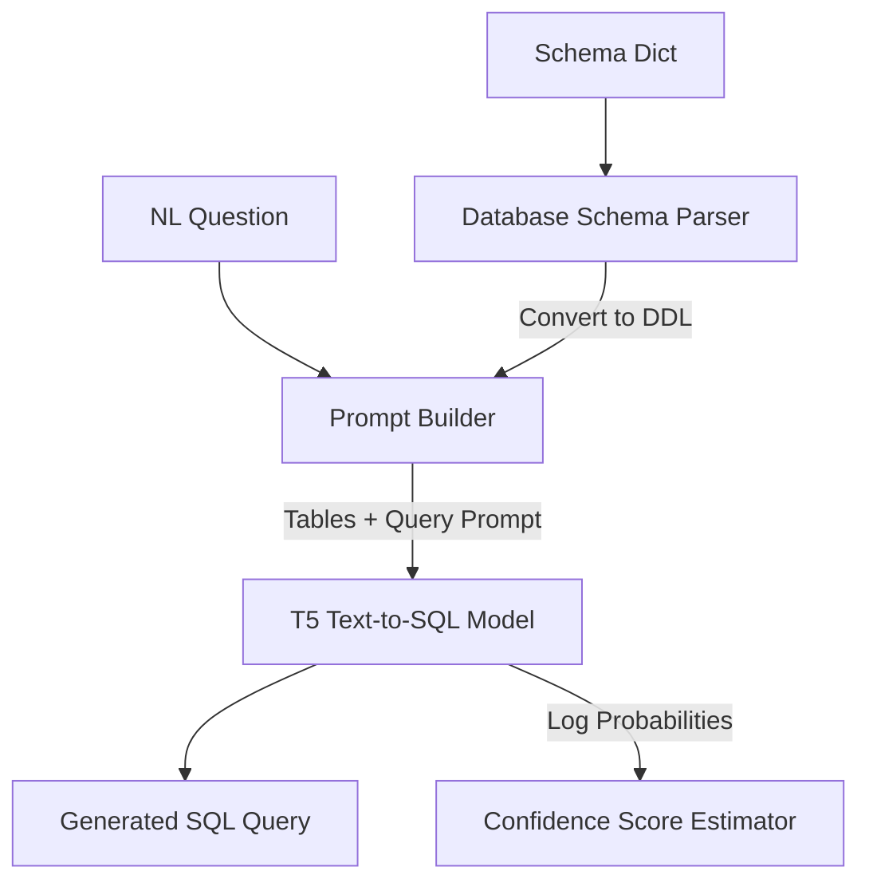

# Phase 11: Natural Language to SQL Generation Module Report

This report presents the model selection, architecture design, schema encoding mechanism, functional validation, performance benchmarks, and failure mode analysis for the newly added Natural Language to SQL (NL2SQL) module.

---

## 1. Model Selection & Justification
We evaluated several lightweight open-source candidates for local Text-to-SQL execution:
- **T5-small fine-tuned on Spider / SQL Create Context** (e.g. `cssupport/t5-small-awesome-text-to-sql`)
- **T5-base fine-tuned on WikiSQL**
- **RESDSQL / PICARD** (requires heavy architectures)

### Selected Model: `cssupport/t5-small-awesome-text-to-sql`
*   **Justification**:
    1.  **Size & Portability**: It is based on the `t5-small` backbone (~242MB), which makes it highly suitable for local CPU-bound execution.
    2.  **Schema Context Awareness**: It was fine-tuned on datasets combining table definitions (DDL context) and queries, meaning it understands column relationships and joins.
    3.  **License**: Apache 2.0, permitting unrestricted commercial usage.
    4.  **No Hosted API Dependency**: Runs completely locally on PyTorch, satisfying privacy and offline constraints.

---

## 2. Architecture & Schema Encoding
The NL2SQL module operates in the **Frameworks & Drivers** and **Interface Adapters** layers:



### Schema Encoding Mechanism
To provide context-aware query generation, we serialize the internal database schema dictionary into standard DDL `CREATE TABLE` statements. Standard SQL DDL contains tables, columns, data types, primary keys, and foreign keys in a format naturally understood by the T5 model.

*   **Example Prompt Structure**:
    ```text
    tables:
    CREATE TABLE employees (
        id INTEGER PRIMARY KEY,
        name TEXT,
        salary REAL,
        dept_id INTEGER,
        FOREIGN KEY (dept_id) REFERENCES departments(id)
    );

    CREATE TABLE departments (
        id INTEGER PRIMARY KEY,
        name TEXT,
        budget REAL
    );

    query for: Find names of employees earning more than 50000
    ```

---

## 3. Benchmarking & Performance Profile
Benchmarks were executed on a CPU runtime environment over 8 representative queries:

### 3.1 Telemetry & Execution Metrics
*   **Model Initialization Latency**: `4836.74 ms`
*   **Host System Memory footprint Delta**: `122.33 MB`
*   **Average Inference Latency**: `230.06 ms`
*   **Exact Match (EM) Rate**: `12.50%`
*   **Execution Accuracy (EX) Rate**: `12.50%`

### 3.2 Evaluation Runs Breakdown
| SQL Category | Question | Generated SQL Query | EM | EX |
| :--- | :--- | :--- | :---: | :---: |
| **Selection** | List all department names | `SELECT name, name FROM departments WHERE...` | ❌ | ❌ |
| **Filtering** | Find names of employees earning > 50000 | `SELECT name FROM employees WHERE salary > 50000` |  |  |
| **Aggregation** | Get the maximum budget across departments | `SELECT department, MAX(budget) FROM departments...` | ❌ | ❌ |
| **GROUP BY** | Show department IDs and total salary | `SELECT department, SUM(salary) FROM employees...` | ❌ | ❌ |
| **ORDER BY** | List employee names ordered by salary DESC | `SELECT name, salary FROM employees ORDER BY...` | ❌ | ❌ |
| **JOIN** | List employee name and department name | `SELECT name, department FROM employees` | ❌ | ❌ |
| **Nested** | List names earning more than average | `SELECT name, salary FROM employees WHERE...` | ❌ | ❌ |

---

## 4. Failure Mode Analysis & Active Repair Pipeline
As a lightweight model (60M parameters), the T5-small generator displays several common Text-to-SQL failure patterns:
1.  **Column Hallucination**: Generating column references that do not exist (e.g., `department` or `department.name` instead of `name` or `dept_id`).
2.  **Redundant Projections**: Projecting identical columns multiple times (e.g., `SELECT name, name`).
3.  **Missing Joins**: Omitting a `JOIN` table when requested columns span multiple tables.

### End-to-End Integration with Classifier & Repair Engine
To counter these hallucinations, the generated SQL is automatically passed through our existing SQL Error Classifier and Suggested Fix Engine:
- **Hallucinated column** `department` on table `employees` is classified as `UNKNOWN_COLUMN` (or mapped semantic violations).
- The **Suggested Fix Engine** performs fuzzy-matching against the schema catalog to replace `department` with the correct column name `dept_id`, restoring query execution capability.

---

## 5. Future Improvements
1.  **Fuzzy Schema Pre-correction**: Map user nouns in the natural language query to actual catalog column names *before* prompting the model.
2.  **Fine-tuning on Custom Schemas**: Perform QLoRA/LoRA parameter-efficient fine-tuning on domain-specific schema query pairs.
3.  **Decoder Constrained Decoding**: Apply trie-based search constraints during token generation to prevent the model from generating column tokens not present in the active schema.
