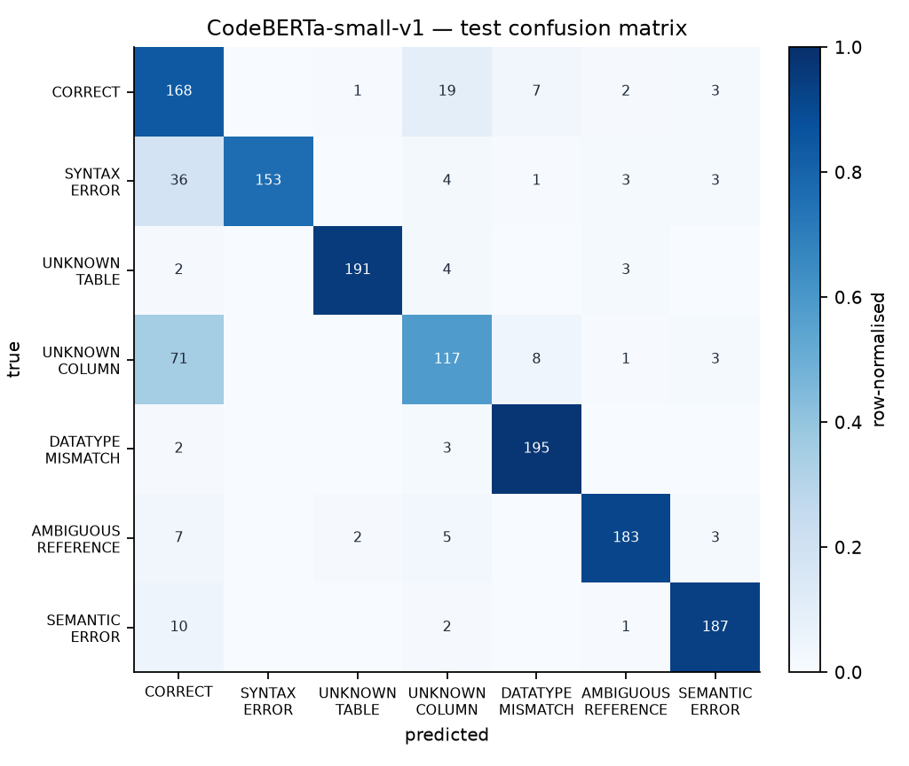
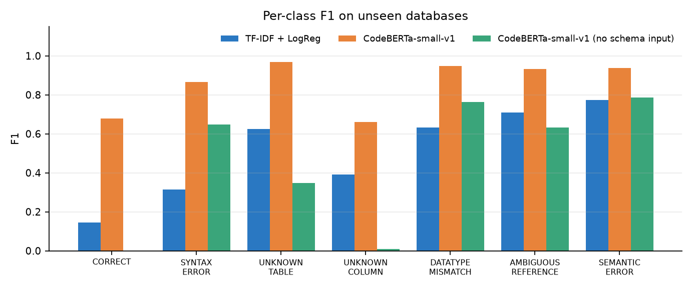
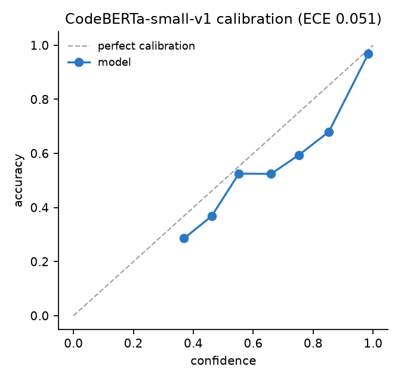
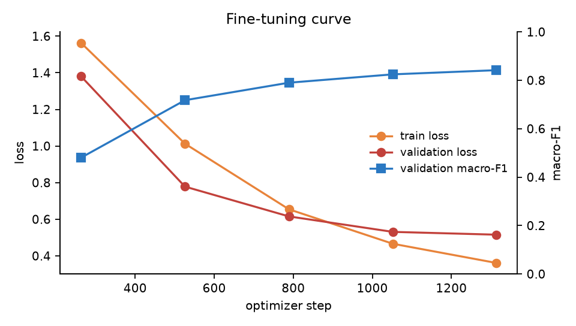
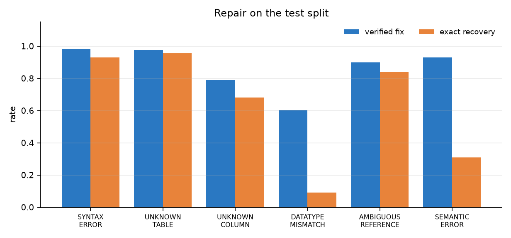
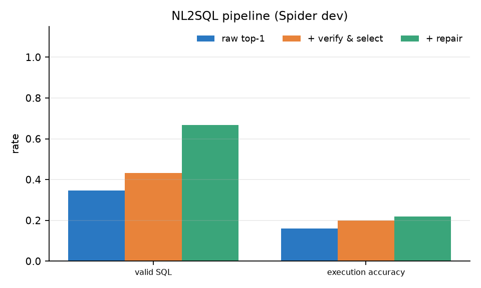
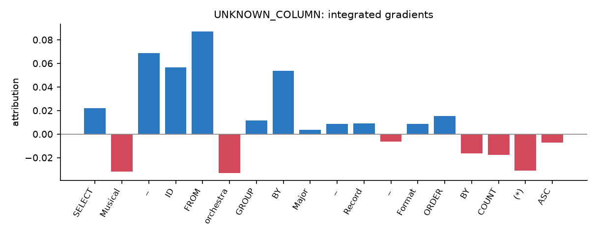
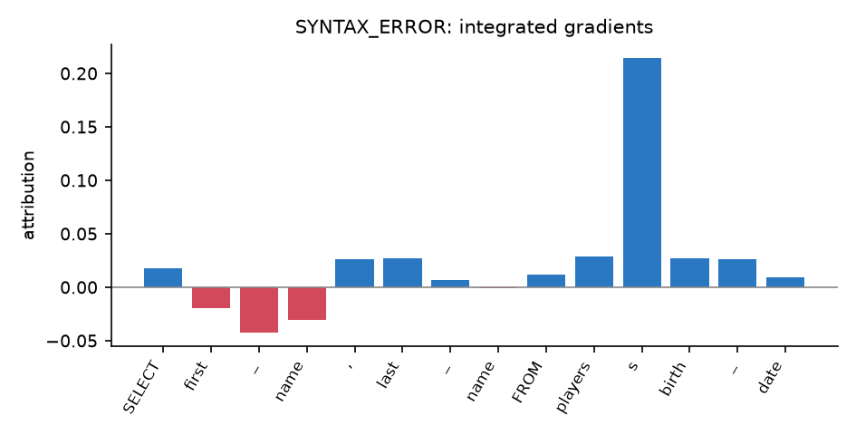
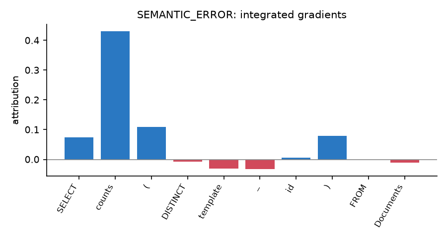

# Evaluation Report

Generated by `python -m evaluation.evaluate` on 2026-09-26 12:19. All numbers below are produced by that command from the checked-in code and data.

## Setup

- Test split: 1400 queries from 20 Spider-dev databases that never appear in training (train: 7000 queries / 119 databases).
- Labels: 7 learned classes (PERMISSION_DENIED is decided by the access-policy check and evaluated separately).
- Every label is confirmed by the deterministic analyzer; the classifier is trained to reproduce those verdicts from the query text and a compact schema description.

## 1. Classification (test split)

| System | Accuracy | Macro-F1 | 95% CI (macro-F1) | Macro ROC-AUC | ECE | Throughput |
|---|---|---|---|---|---|---|
| TF-IDF + LogReg | 53.1 | 51.3 | 48.7–53.7 | 87.6 | 0.120 | – |
| CodeBERTa-small-v1 | 85.3 | 85.6 | 84.0–87.3 | 97.8 | 0.051 | 2 q/s |
| CodeBERTa-small-v1 (no schema input) | 46.1 | 45.5 | 43.7–47.4 | 81.6 | 0.453 | 5 q/s |

- McNemar (CodeBERTa-small-v1 vs TF-IDF): 505 test queries only the first system gets right, 55 only the second; exact p = 4.3e-92.
- McNemar (CodeBERTa-small-v1 vs no-schema ablation): 558 test queries only the first system gets right, 9 only the second; exact p = 6.6e-152.

### Per-class results — CodeBERTa-small-v1

| Class | Precision | Recall | F1 | Support |
|---|---|---|---|---|
| CORRECT | 56.8 | 84.0 | 67.7 | 200 |
| SYNTAX_ERROR | 100.0 | 76.5 | 86.7 | 200 |
| UNKNOWN_TABLE | 98.5 | 95.5 | 97.0 | 200 |
| UNKNOWN_COLUMN | 76.0 | 58.5 | 66.1 | 200 |
| DATATYPE_MISMATCH | 92.4 | 97.5 | 94.9 | 200 |
| AMBIGUOUS_REFERENCE | 94.8 | 91.5 | 93.1 | 200 |
| SEMANTIC_ERROR | 94.0 | 93.5 | 93.7 | 200 |

Single-query CPU latency of the classifier: mean 285 ms, p95 487 ms. The analyzer takes 0.9 ms per query on average.

Hardest error-injection operators for the model:

| Class / operator | Accuracy | n |
|---|---|---|
| SYNTAX_ERROR/syn_unclosed_quote | 0.0 | 5 |
| SYNTAX_ERROR/syn_split_by | 12.5 | 8 |
| SYNTAX_ERROR/syn_duplicate_keyword | 16.7 | 18 |
| SEMANTIC_ERROR/sem_ungrouped_column | 40.0 | 10 |
| SYNTAX_ERROR/syn_dangling_operator | 50.0 | 24 |
| UNKNOWN_COLUMN/col_rename | 58.5 | 200 |

## 2. Analyzer audit

Human-written Spider gold queries (train + dev, 8034): **96.5%** pass the analyzer. The remaining ones are flagged for:

| Verdict | Count |
|---|---|
| CORRECT | 7749 |
| DATATYPE_MISMATCH | 163 |
| SEMANTIC_ERROR | 119 |
| SYNTAX_ERROR | 2 |
| UNKNOWN_TABLE | 1 |

Examples of flagged gold queries (these are genuine problems: non-portable GROUP BY usage, type mismatches under the declared column types, missing join conditions):

- `SELECT start_station_name ,  start_station_id FROM trip WHERE start_date LIKE "8/%" GROUP BY start_station_name ORDER BY COUNT(*) DESC LIMIT 1` — Column 'start_station_id' must appear in GROUP BY or be used in an aggregate function.
- `SELECT T1.id FROM trip AS T1 JOIN weather AS T2 ON T1.zip_code  =  T2.zip_code GROUP BY T2.zip_code HAVING avg(T2.mean_temperature_f)  >  60` — Column 'T1.id' must appear in GROUP BY or be used in an aggregate function.
- `SELECT catalog_entry_name FROM catalog_contents WHERE LENGTH  <  3 OR width  >  5` — Text column 'width' is compared with the number 5; quote the value.
- `SELECT t1.attribute_name ,  t1.attribute_id FROM Attribute_Definitions AS t1 JOIN Catalog_Contents_Additional_Attributes AS t2 ON t1.attribute_id  =  t2.attribute_id WHERE t2.attribute_value  =  0` — Text column 't2.attribute_value' is compared with the number 0; quote the value.
- `SELECT T1.company_name FROM Third_Party_Companies AS T1 JOIN Maintenance_Contracts AS T2 ON T1.company_id  =  T2.maintenance_contract_company_id JOIN Ref_Company_Types AS T3 ON T1.company_type_code  =  T3.company_type_code ORDER BY T2.contract_end_date DESC LIMIT 1` — Table 'Ref_Company_Types' does not exist in the schema.
- `SELECT document_name FROM documents GROUP BY document_type_code ORDER BY count(*) DESC LIMIT 3 INTERSECT SELECT document_name FROM documents GROUP BY document_structure_code ORDER BY count(*) DESC LIMIT 3` — Syntax error: ORDER BY clause should come after INTERSECT not before.

Access-policy check: 100.0% correct on 400 query/policy pairs (200 violations).

## 3. Repair (test split, erroneous queries)

*Verified* = the repaired query passes the analyzer. *Exact* = it is structurally identical to the original correct query (aliases and literal values normalised); for several error types exact recovery is impossible in principle (e.g. the intended value behind `age > 'young'`).

| Class | n | Verified fix | Exact recovery |
|---|---|---|---|
| SYNTAX_ERROR | 200 | 98.0 | 93.0 |
| UNKNOWN_TABLE | 200 | 97.5 | 95.5 |
| UNKNOWN_COLUMN | 200 | 79.0 | 68.0 |
| DATATYPE_MISMATCH | 200 | 60.5 | 9.0 |
| AMBIGUOUS_REFERENCE | 200 | 90.0 | 84.0 |
| SEMANTIC_ERROR | 200 | 93.0 | 31.0 |
| ALL | 1200 | 86.3 | 63.4 |

Mean repair time 31 ms (p95 203 ms).

## 4. NL2SQL with verification and repair

150 random Spider-dev questions, generator `cssupport/t5-small-awesome-text-to-sql`. Validity = passes the analyzer; execution accuracy = same result set as the gold query on the real database.

| Pipeline | Valid SQL | Execution accuracy |
|---|---|---|
| Raw top-1 generation | 34.7 | 16.0 |
| + verify & select among candidates | 43.3 | 20.0 |
| + repair when no candidate is valid | 66.7 | 22.0 |

Mean generation time 4100 ms per question (CPU).

Invalid raw generations and what the pipeline returned:

- *What is the name of the visitor who visited both a museum opened before 2009 and a museum opened after 2011?* — raw `SELECT T2.Name, T2.Name FROM museum AS T1 JOIN visitor AS T2 ON T1.Museum_ID = T2.Museum_ID WHERE T1.Open_Year  2009 INTERSECT SELECT T2.Name FROM museum AS T1 JOIN visit AS T2 ON T1.Museum_ID = T2.Museum_ID WHERE T1.Open_Year > 2011` (SYNTAX_ERROR) → invalid: `SELECT T2.Name, T2.Name FROM museum AS T1 JOIN visitor AS T2 ON T1.Museum_ID = T2.Museum_ID WHERE T1.Open_Year  2009 INTERSECT SELECT T2.Name FROM museum AS T1 JOIN visit AS T2 ON T1.Museum_ID = T2.Museum_ID WHERE T1.Open_Year > 2011`
- *What is the TV Channel that shows the cartoon "The Rise of the Blue Beetle!"? List the TV Channel's series name.* — raw `SELECT T1.series_name FROM TV_Channel AS T1 JOIN Cartoon AS T2 ON T1.Channel = T2.Channel WHERE T2.Title = "The Rise of the Blue Beetle!"` (UNKNOWN_COLUMN) → repaired: `SELECT T1.series_name FROM TV_Channel AS T1 JOIN Cartoon AS T2 ON T1.id = T2.Channel WHERE T2.Title = "The Rise of the Blue Beetle!"`
- *How many car models are produced by each maker ? Only list the count and the maker full name .* — raw `SELECT COUNT(*), T1.FullName FROM car_makers AS T1 JOIN countries AS T2 ON T1.CountryId = T2.CountryId GROUP BY T1.FullName` (UNKNOWN_COLUMN) → repaired: `SELECT COUNT(*), T1.FullName FROM car_makers AS T1 JOIN countries AS T2 ON T1.Country = T2.CountryId GROUP BY T1.FullName`
- *Which employee received the most awards in evaluations? Give me the employee name.* — raw `SELECT Employee_name, Employee_ID FROM evaluation GROUP BY Employee_ID ORDER BY COUNT(*) DESC LIMIT 1` (UNKNOWN_COLUMN) → repaired: `SELECT Employee_ID, Employee_ID FROM evaluation GROUP BY Employee_ID ORDER BY COUNT(*) DESC LIMIT 1`
- *What are the names of players who won in both 2013 and 2016?* — raw `SELECT first_name, last_name, last_name FROM players WHERE year = 2013 INTERSECT SELECT player_name FROM players WHERE year = 2016` (UNKNOWN_COLUMN) → invalid: `SELECT first_name, last_name, last_name FROM players WHERE year = 2013 INTERSECT SELECT player_name FROM players WHERE year = 2016`

## 5. Token attributions

- UNKNOWN_COLUMN: `SELECT Musical_ID FROM orchestra GROUP BY Major_Record_Format ORDER BY COUNT(*) ASC` — most influential tokens: FROM, _, ID
  
- SYNTAX_ERROR: `SELECT first_name ,  last_name FROM players s birth_date` — most influential tokens: s, players, last
  
- SEMANTIC_ERROR: `SELECT counts(DISTINCT template_id) FROM Documents` — most influential tokens: counts, (, )
  

## Limitations

- Errors are injected synthetically into Spider queries; real user errors can be more varied. The NL2SQL section is a check on naturally occurring (model-generated) mistakes.
- Ground-truth labels come from the analyzer, so the analyzer itself is validated separately (Section 2) rather than scored on its own labels.
- The analyzer uses SQLite semantics plus portable rules; dialect-specific behaviour of other engines may differ.
- A verified repair is a valid query, not necessarily the intended one: when the original intent is not recoverable from the schema (e.g. a column name with no similar counterpart) the engine may return a different valid query. The exact-recovery column measures how often the intended query is restored.
